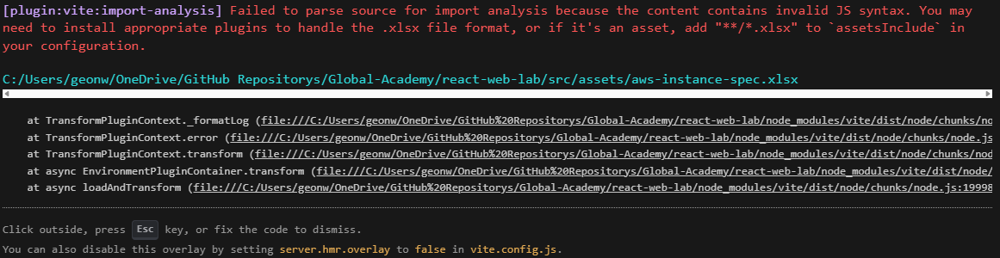
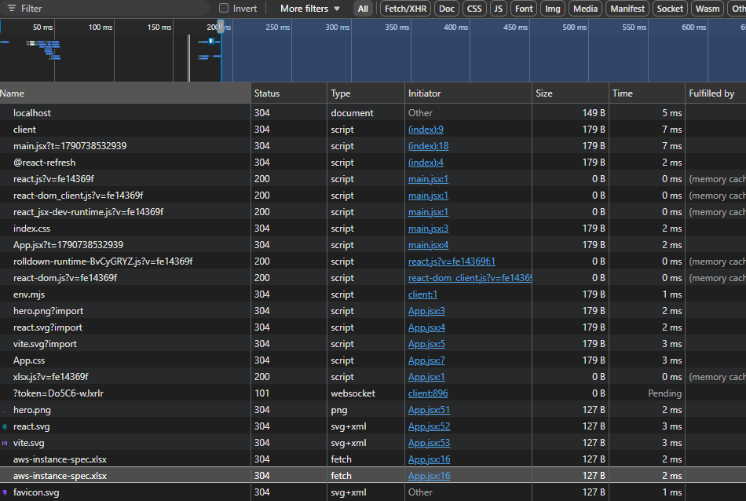

### 1. [N-001] Node installing python installer error
```ps
ERROR: Running ["C:\ProgramData\chocolatey\lib\python314\tools\python-3.14.7-amd64.exe" /quiet InstallAllUsers=1 PrependPath=1 TargetDir="C:\Python314"] was not successful. Exit code was '1603'. Exit code indicates the following: Generic MSI Error. This is a local environment error, not an issue with a package or the MSI itself - it could mean a pending reboot is necessary prior to install or something else (like the same version is already installed). Please see MSI log if available. If not, try again adding '--install-arguments="'/l*v c:\python314_msi_install.log'"'. Then search the MSI Log for "Return Value 3" and look above that for the error..
The upgrade of python314 was NOT successful.
Error while running 'C:\ProgramData\chocolatey\lib\python314\tools\chocolateyInstall.ps1'.
 See log for details.
Failed to install python3 because a previous dependency failed.
Failed to install python because a previous dependency failed.
visualstudio2026-workload-vctools is not installed. Installing...
```

#### **User Comment**

위와 같이 Node 설치 중 발생하는 Python 3.14.7의 MSI 설치 에러 (`Exit code was '1603'`) 가 발생하고 log를 통해 확인을 해야 한다는 에러가 출력되었으며, `Return Value 3` 이라는 오류 코드 출력 동시에 업그레이드에 관한 성공하지 못했다는 문구를 보아 이는 이미 Python 3.14.7 이라는 프로그램이 설치 되어 있거나 혹은 설치 중 재부팅 관련 및 종속성 이슈가 존재하는 걸로 판단된다.

#### **AI Comment**

위와 같이 Node 설치 과정에서 Python 3.14.7 패키지 설치 중 MSI Installer 오류(Exit Code 1603)가 발생하였다. 로그상 Generic MSI Error가 출력되며, Chocolatey에서도 Python 업그레이드가 정상적으로 완료되지 않았음을 확인할 수 있다.

Exit Code 1603은 일반적인 MSI 설치 실패 코드로, 설치 프로그램 자체의 문제보다는 로컬 환경 이슈로 인해 발생하는 경우가 많다. 대표적인 원인으로는 시스템 재부팅 대기 상태(Pending Reboot), 기존 Python 설치 버전과의 충돌, 권한 문제, 설치 경로 충돌 등이 있다.

로그 메시지에서 안내한 것처럼 상세 원인 확인을 위해 MSI 로그를 생성한 후 Return Value 3 항목을 검색하여, 해당 위치 직전의 에러 메시지를 분석할 필요가 있다. 현재 로그만으로는 정확한 실패 원인을 특정할 수 없으며 추가 로그 확인이 필요하다.

---

### 2. [N-002] React Installer Error

```ps
npm error code EPERM
npm error syscall mkdir
npm error path C:\Windows\System32\node_modules
npm error errno -4048
npm error Error: EPERM: operation not permitted, mkdir 'C:\Windows\System32\node_modules'
npm error     at async mkdir (node:internal/fs/promises:1564:10)
npm error     at async C:\Program Files\nodejs\node_modules\npm\node_modules\@npmcli\arborist\lib\arborist\reify.js:624:20
npm error     at async Promise.allSettled (index 0)
npm error     at async #reifyPackages (C:\Program Files\nodejs\node_modules\npm\node_modules\@npmcli\arborist\lib\arborist\reify.js:353:11)
npm error     at async Arborist.reify (C:\Program Files\nodejs\node_modules\npm\node_modules\@npmcli\arborist\lib\arborist\reify.js:139:7)
npm error     at async Install.exec (C:\Program Files\nodejs\node_modules\npm\lib\commands\install.js:158:5)
npm error     at async Npm.exec (C:\Program Files\nodejs\node_modules\npm\lib\npm.js:193:9)
npm error     at async module.exports (C:\Program Files\nodejs\node_modules\npm\lib\cli\entry.js:67:5) {
npm error   errno: -4048,
npm error   code: 'EPERM',
npm error   syscall: 'mkdir',
npm error   path: 'C:\\Windows\\System32\\node_modules'
npm error }
npm error
npm error The operation was rejected by your operating system.
npm error It's possible that the file was already in use (by a text editor or antivirus), or that you lack permissions to access it.
npm error
npm error If you believe this might be a permissions issue, please double-check the permissions of the file and its containing directories, or try running the command again as root/Administrator.
npm notice
npm notice New major version of npm available! 11.19.0 -> 12.1.0
npm notice Changelog: https://github.com/npm/cli/releases/tag/v12.1.0
npm notice To update run: npm install -g npm@12.1.0
npm notice
npm error A complete log of this run can be found in: C:\Users\geonw\AppData\Local\npm-cache\_logs\2026-09-29T08_26_18_520Z-debug-0.log
```

#### **User Comment**

[N-002](#2-n-002-react-installer-error)는 npm 종속성 충돌 발생으로 업데이트된 버전인 `12.1.0` 으로 종속성 충돌 무시 CMD 입력을 하라는 표시인거 같다. 하지만 `npm install -g npm@12.1.0`과 같은 강제 CMD를 입력했을 경우 향후 패키지나 디렉터리의 파일 손상을 염려가 생각된다.

#### **AI Comment**

React 프로젝트 설치 과정에서 npm이 C:\Windows\System32\node_modules 디렉터리를 생성하려고 시도하였으나 운영체제로부터 접근이 거부되며 EPERM (Error Permission) 오류가 발생하였다.
로그상 mkdir 수행 중 권한 문제가 발생한 것으로 확인되며, 이는 관리자 권한 부족, 잘못된 작업 디렉터리 위치(System32), 또는 보안 프로그램에 의한 접근 제한 등이 원인일 수 있다.
또한 로그에 표시된 npm install -g npm@12.1.0 명령어는 최신 npm 버전으로의 업데이트를 안내하는 일반적인 메시지일 뿐이며, 현재 발생한 EPERM 오류와 직접적인 관련은 없는 것으로 판단된다.
따라서 npm 버전 업그레이드보다는 현재 작업 경로 및 사용자 권한 설정을 우선적으로 점검할 필요가 있다.

#### **Soultion**

해당 문제는 PowerShell에서 잘못된 명령어 입력으로 인해 위와 같은 문제가 발생 했으나 [Advance React Note](../advance/react.md/#react-installation-cli)을 참조하여 vite cmd를 입력한 결과 React 템플릿과 함께 정상적으로 설치 되는 것을 확인함. 다만 왜 공식 문서에 따르면 `devDependency` 설치 명령어가 문제가 발생하는지는 추가로 조사해 볼 필요가 있어 보임.

---

### 3. [N-003] vite of can't read to `xlsx` file



```md
[plugin:vite:import-analysis] Failed to parse source for import analysis because the content contains invalid JS syntax. 
You may need to install appropriate plugins to handle the .xlsx file format, or if it's an asset, add "**/*.xlsx" to `assetsInclude` in your configuration.
```

#### **User Comment**

[N-003](#3-n-003-vite-of-cant-read-to-xlsx-file)의 문제는 vite에서 JS 모듈 형태로 처리하려는 과정으로 시도되어 위의 사진과 같은 에러가 출력된다. 하지만 `/assets` 경로에 파일을 불러오고자 하였을 때나 `/public` 으로 경로를 추적할 수 있도록 파일의 디렉터리 위치 변경 진행 후 테스트 결과는 모든 데이터 값이 출력 됐으나, 읽고 데이터를 불러오는 과정에서 내부의 다른 시트가 존재하더라도 그 시트 데이터는 읽어 오지 못한다. 그렇다면 왠만한 첫 번째 시트에 주요 데이터를 기입하고 그외 시트들의 데이터는 함수를 통해 첫 번째 시트로 데이터를 전달할 수 있도록 변경을 하도록 생각한다.


#### **AI Comment**

에러 메시지를 보면 핵심 원인은 Vite가 .xlsx 파일을 JavaScript 모듈로 해석하려고 시도했다는 것입니다. 또한 Vite는 기본적으로 .xlsx를 정적 에셋으로 처리하지 않기 때문에 발생하는 오류입니다.

#### **Soultion**

<details>
<summary>Code</summary>

```jsx
import * as XLSX from 'xlsx'

const [excelData, setExcelData] = useState([])

  useEffect(() => {
    fetch('/aws-instance-spec.xlsx')
    .then((response) => response.arrayBuffer())
    .then((arrayBuffer) => {
      const workbook = XLSX.read(arrayBuffer, {
      type: 'array',
    })
     
      const sheetName = workbook.SheetNames[0]
      const sheet = workbook.Sheets[sheetName]
       
      const parsedData = XLSX.utils.sheet_to_json(sheet)
       
      setExcelData(parsedData)
    })
    .catch((error) => {
      console.error(error)
    })
  }, [])

  const table_headler_title = [
    "인스턴스 유형",
    "메모리 (GiB)",
    "처리자",
    "vCPU",
    "CPU 수",
    "코어당 스레드",
    "액셀러레이터",
    "액셀러레이터 메모리",
  ]

<section id="aws-instance-spec-table">
    <table>
        <thead>
        <tr>
            {table_headler_title.map((title, index) => (
                <th key={index}>{title}</th>
            ))}
        </tr>
        </thead>
        <tbody>
        {excelData.map((row, index) => (
            <tr key={index}>
                {table_headler_title.map((title, index) => (
                    <td key={index}>{row[title]}</td>
                ))}
            {/* <td>{row['인스턴스 유형']}</td>
            <td>{row['메모리 (GiB)']}</td>
            <td>{row['처리자']}</td>
            <td>{row['vCPU']}</td>
            <td>{row['CPU 수']}</td>
            <td>{row['코어당 스레드']}</td>
            <td>{row['액셀러레이터']}</td>
            <td>{row['액셀러레이터 메모리']}</td> */}
            </tr>
        ))}
        </tbody>
    </table>
</section>
```

</details>

#### Result

<details>
<summary>Result Web dev tool network</summary>



</details>

---